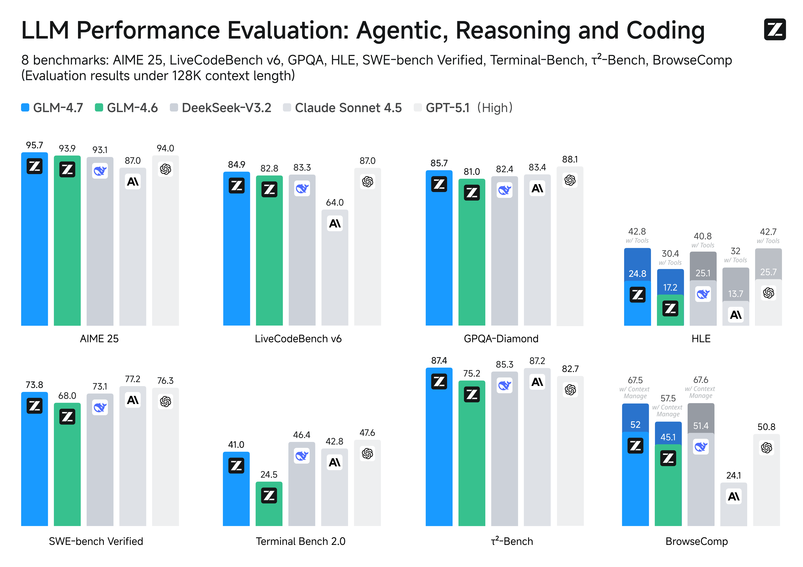
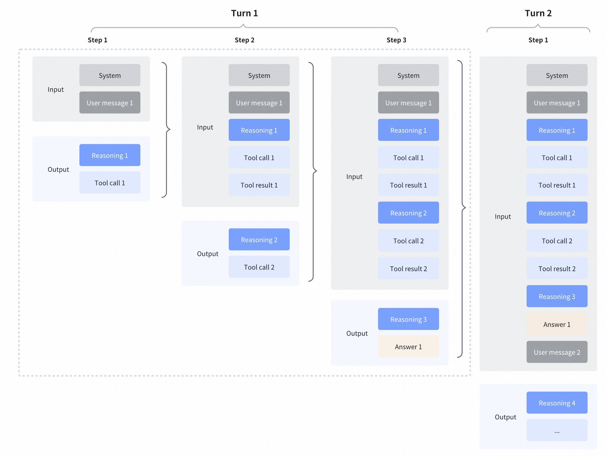

# GLM-4.7 & GLM-4.6 & GLM-4.5

[中文阅读](./README_zh.md) | [日本語版](./README_ja.md)

<div align="center">

</div>
<p align="center">
    👋 Join our <a href="resources/WECHAT.md" target="_blank">WeChat</a> or <a href="https://discord.gg/QR7SARHRxK" target="_blank">Discord</a> community.
    <br>
    📖 Check out the GLM-4.7 <a href="https://z.ai/blog/glm-4.7" target="_blank">technical blog</a>, <a href="https://arxiv.org/abs/2508.06471" target="_blank">technical report(GLM-4.5)</a>, and <a href="https://zhipu-ai.feishu.cn/wiki/Gv3swM0Yci7w7Zke9E0crhU7n7D" target="_blank">Zhipu AI technical documentation</a>.
    <br>
    📍 Use GLM-4.7 API services on <a href="https://docs.z.ai/guides/llm/glm-4.7">Z.ai API Platform</a>.
    <br>
    👉 One click to <a href="https://chat.z.ai">GLM-4.7</a>.
</p>

## Model Introduction

### GLM-4.7

**GLM-4.7**, your new coding partner, is coming with the following features:

- **Core Coding**: GLM-4.7 brings clear gains, compared to its predecessor GLM-4.6, in multilingual agentic coding and terminal-based tasks, including (73.8%, +5.8%) on SWE-bench, (66.7%, +12.9%) on SWE-bench Multilingual, and (41%, +16.5%) on Terminal Bench 2.0. GLM-4.7 also supports thinking before acting, with significant improvements on complex tasks in mainstream agent frameworks such as Claude Code, Kilo Code, Cline, and Roo Code.
- **Vibe Coding**: GLM-4.7 takes a big step forward in improving UI quality. It produces cleaner, more modern webpages and generates better-looking slides with more accurate layout and sizing.
- **Tool Using**: GLM-4.7 achieves significantly improvements in Tool using. Significant better performances can be seen on benchmarks such as τ^2-Bench and on web browsing via BrowseComp.
- **Complex Reasoning**: GLM-4.7 delivers a substantial boost in mathematical and reasoning capabilities, achieving (42.8%, +12.4%) on the HLE (Humanity’s Last Exam) benchmark compared to GLM-4.6.

More general, one would also witness significant improvements in many other scenarios such as chat, creative writing, and role-play scenario.



**Interleaved Thinking & Preserved Thinking**



GLM-4.7 further enhances **Interleaved Thinking** (a feature introduced since GLM-4.5) and introduces **Preserved Thinking** and **Turn-level Thinking**. By thinking between actions and staying consistent across turns, it makes complex tasks more stable and more controllable:
- **Interleaved Thinking**: The model thinks before every response and tool calling, improving instruction following and the quality of generation.
- **Preserved Thinking**: In coding agent scenarios, the model automatically retains all thinking blocks across multi-turn conversations, reusing the existing reasoning instead of re-deriving from scratch. This reduces information loss and inconsistencies, and is well-suited for long-horizon, complex tasks.
- **Turn-level Thinking**: The model supports per-turn control over reasoning within a session—disable thinking for lightweight requests to reduce latency/cost, enable it for complex tasks to improve accuracy and stability.

More details: https://docs.z.ai/guides/capabilities/thinking-mode

We also provide the lightweight 30B-A3B model GLM-4.7-Flash, offering a new option for lightweight deployment that balances performance and efficiency.

### GLM-4.6

Compared with GLM-4.5, **GLM-4.6**  brings several key improvements:

- **Longer context window:** The context window has been expanded from 128K to 200K tokens, enabling the model to handle more complex agentic tasks.
- **Superior coding performance:** The model achieves higher scores on code benchmarks and demonstrates better real-world performance in applications such as Claude Code、Cline、Roo Code and Kilo Code, including improvements in generating visually polished front-end pages.
- **Advanced reasoning:** GLM-4.6 shows a clear improvement in reasoning performance and supports tool use during inference, leading to stronger overall capability.
- **More capable agents:** GLM-4.6 exhibits stronger performance in tool using and search-based agents, and integrates more effectively within agent frameworks.
- **Refined writing:** Better aligns with human preferences in style and readability, and performs more naturally in role-playing scenarios.

We evaluated GLM-4.6 across eight public benchmarks covering agents, reasoning, and coding. Results show clear gains over GLM-4.5, with GLM-4.6 also holding competitive advantages over leading domestic and international models such as **DeepSeek-V3.1-Terminus** and **Claude Sonnet 4**.

### GLM-4.5

The **GLM-4.5** series models are foundation models designed for intelligent agents. GLM-4.5 has **355** billion total
parameters with **32** billion active parameters, while GLM-4.5-Air adopts a more compact design with **106** billion
total parameters and **12** billion active parameters. GLM-4.5 models unify reasoning, coding, and intelligent agent
capabilities to meet the complex demands of intelligent agent applications.

Both GLM-4.5 and GLM-4.5-Air are hybrid reasoning models that provide two modes: thinking mode for complex reasoning and
tool usage, and non-thinking mode for immediate responses.

We have open-sourced the base models, hybrid reasoning models, and FP8 versions of the hybrid reasoning models for both
GLM-4.5 and GLM-4.5-Air. They are released under the MIT open-source license and can be used commercially and for
secondary development.

As demonstrated in our comprehensive evaluation across 12 industry-standard benchmarks, GLM-4.5 achieves exceptional
performance with a score of **63.2**, in the **3rd** place among all the proprietary and open-source models. Notably,
GLM-4.5-Air delivers competitive results at **59.8** while maintaining superior efficiency.

For more eval results, show cases, and technical details, please visit our [technical report](https://arxiv.org/abs/2508.06471).

## Model Downloads

| Model            | Download Links                                                                                                                                | Model Size | Precision |
|------------------|-----------------------------------------------------------------------------------------------------------------------------------------------|------------|-----------|
| GLM-4.7          | [🤗 Hugging Face](https://huggingface.co/zai-org/GLM-4.7)<br> [🤖 ModelScope](https://modelscope.cn/models/ZhipuAI/GLM-4.7)                   | 355B-A32B  | BF16      |
| GLM-4.7-FP8      | [🤗 Hugging Face](https://huggingface.co/zai-org/GLM-4.7-FP8)<br> [🤖 ModelScope](https://modelscope.cn/models/ZhipuAI/GLM-4.7-FP8)           | 355B-A32B  | FP8       |
| GLM-4.7-Flash    | [🤗 Hugging Face](https://huggingface.co/zai-org/GLM-4.7-Flash)<br> [🤖 ModelScope](https://modelscope.cn/models/ZhipuAI/GLM-4.7-Flash)       | 30B-A3B    | BF16      |
| GLM-4.6          | [🤗 Hugging Face](https://huggingface.co/zai-org/GLM-4.6)<br> [🤖 ModelScope](https://modelscope.cn/models/ZhipuAI/GLM-4.6)                   | 355B-A32B  | BF16      |
| GLM-4.6-FP8      | [🤗 Hugging Face](https://huggingface.co/zai-org/GLM-4.6-FP8)<br> [🤖 ModelScope](https://modelscope.cn/models/ZhipuAI/GLM-4.6-FP8)           | 355B-A32B  | FP8       |
| GLM-4.5          | [🤗 Hugging Face](https://huggingface.co/zai-org/GLM-4.5)<br> [🤖 ModelScope](https://modelscope.cn/models/ZhipuAI/GLM-4.5)                   | 355B-A32B  | BF16      |
| GLM-4.5-Air      | [🤗 Hugging Face](https://huggingface.co/zai-org/GLM-4.5-Air)<br> [🤖 ModelScope](https://modelscope.cn/models/ZhipuAI/GLM-4.5-Air)           | 106B-A12B  | BF16      |
| GLM-4.5-FP8      | [🤗 Hugging Face](https://huggingface.co/zai-org/GLM-4.5-FP8)<br> [🤖 ModelScope](https://modelscope.cn/models/ZhipuAI/GLM-4.5-FP8)           | 355B-A32B  | FP8       |
| GLM-4.5-Air-FP8  | [🤗 Hugging Face](https://huggingface.co/zai-org/GLM-4.5-Air-FP8)<br> [🤖 ModelScope](https://modelscope.cn/models/ZhipuAI/GLM-4.5-Air-FP8)   | 106B-A12B  | FP8       |
| GLM-4.5-Base     | [🤗 Hugging Face](https://huggingface.co/zai-org/GLM-4.5-Base)<br> [🤖 ModelScope](https://modelscope.cn/models/ZhipuAI/GLM-4.5-Base)         | 355B-A32B  | BF16      |
| GLM-4.5-Air-Base | [🤗 Hugging Face](https://huggingface.co/zai-org/GLM-4.5-Air-Base)<br> [🤖 ModelScope](https://modelscope.cn/models/ZhipuAI/GLM-4.5-Air-Base) | 106B-A12B  | BF16      |

- The model code, tool parser and reasoning parser of GLM-4.5, GLM-4.6 and GLM-4.7 can be found in the implementation of [transformers](https://github.com/huggingface/transformers/tree/main/src/transformers/models/glm4_moe), [vLLM](https://github.com/vllm-project/vllm/blob/main/vllm/model_executor/models/glm4_moe_mtp.py) and [SGLang](https://github.com/sgl-project/sglang/blob/main/python/sglang/srt/models/glm4_moe.py).
- The model code of  GLM-4.7-Flash can be found in the implementation of [transformers](https://github.com/huggingface/transformers/tree/main/src/transformers/models/glm4_moe_lite), [vLLM](https://github.com/vllm-project/vllm/blob/main/vllm/model_executor/models/glm4_moe_lite_mtp.py) and [SGLang](https://github.com/sgl-project/sglang/blob/main/python/sglang/srt/models/glm4_moe_lite.py).

## System Requirements

### Inference with Nvidia GPUs

We provide minimum and recommended configurations for "full-featured" model inference. The data in the table below is
based on the following conditions:

1. All models use MTP layers and specify
   `--speculative-num-steps 3 --speculative-eagle-topk 1 --speculative-num-draft-tokens 4` to ensure competitive
   inference speed.
2. The `cpu-offload` parameter is not used.
3. Inference batch size does not exceed `8`.
4. All are executed on devices that natively support FP8 inference, ensuring both weights and cache are in FP8 format.
5. Server memory must exceed `1T` to ensure normal model loading and operation.

The models can run under the configurations in the table below:

| Model         | Precision | GPU Type and Count |
|---------------|-----------|--------------------|
| GLM-4.5       | BF16      | H100 x 16          |
| GLM-4.5       | FP8       | H100 x 8           |
| GLM-4.5-Air   | BF16      | H100 x 4           |
| GLM-4.5-Air   | FP8       | H100 x 2           |
| GLM-4.7-Flash | BF16      | H100 x 1           |

Under the configurations in the table below, the models can utilize their full 128K context length:

| Model         | Precision   | GPU Type and Count |
|---------------|-------------|--------------------|
| GLM-4.5       | BF16        | H100 x 32          |
| GLM-4.5       | FP8         | H100 x 16          |
| GLM-4.5-Air   | BF16        | H100 x 8           |
| GLM-4.5-Air   | FP8         | H100 x 4           |
| GLM-4.7-Flash | BF16        | H100 x 2           |

### Other Devices

- To perform fast inference on Ascend A3 devices using [xLLM](https://github.com/jd-opensource/xllm), please refer to the [Ascend NPU Deployment Guide](example/Ascend_NPU/README_zh.md).  
- To run inference on AMD GPUs, please refer to the [AMD GPU Deployment Guide](example/AMD_GPU/README.md).

### Fine-tuning

The code can run under the configurations in the table below using [Llama Factory](https://github.com/hiyouga/LLaMA-Factory):

| Model       | GPU Type and Count | Strategy | Batch Size (per GPU) |
|-------------|--------------------|----------|----------------------|
| GLM-4.5     | H100 x 16          | Lora     | 1                    |
| GLM-4.5-Air | H100 x 4           | Lora     | 1                    |

The code can run under the configurations in the table below using [Swift](https://github.com/modelscope/ms-swift):

| Model       | GPU Type and Count | Strategy | Batch Size (per GPU) |
|-------------|--------------------|----------|----------------------|
| GLM-4.5     | H20 (96GiB) x 16   | Lora     | 1                    |
| GLM-4.5-Air | H20 (96GiB) x 4    | Lora     | 1                    |
| GLM-4.5     | H20 (96GiB) x 128  | SFT      | 1                    |
| GLM-4.5-Air | H20 (96GiB) x 32   | SFT      | 1                    |
| GLM-4.5     | H20 (96GiB) x 128  | RL       | 1                    |
| GLM-4.5-Air | H20 (96GiB) x 32   | RL       | 1                    |

## Quick Start

Install dependencies (sglang, vllm, etc.) according to the configuration requirements in `requirements.txt`.

### transformers

Please refer to the `trans_infer_cli.py` code in the `inference` folder.

### vLLM

```shell
vllm serve zai-org/GLM-4.7-FP8 \
     --tensor-parallel-size 4 \
     --speculative-config.method mtp \
     --speculative-config.num_speculative_tokens 1 \
     --tool-call-parser glm47 \
     --reasoning-parser glm45 \
     --enable-auto-tool-choice \
     --served-model-name glm-4.7-fp8
```

### SGLang

```shell
python3 -m sglang.launch_server \
  --model-path zai-org/GLM-4.7-FP8 \
  --tp-size 8 \
  --tool-call-parser glm47  \
  --reasoning-parser glm45 \
  --speculative-algorithm EAGLE \
  --speculative-num-steps 3 \
  --speculative-eagle-topk 1 \
  --speculative-num-draft-tokens 4 \
  --mem-fraction-static 0.8 \
  --served-model-name glm-4.7-fp8 \
  --host 0.0.0.0 \
  --port 8000
```

- PD-Disaggregation

The following is a simple method to implement PD-Disaggregation using a single machine with multiple GPUs, P and D each use 4 GPUs for GLM-4.5

```shell
python -m sglang.launch_server --model-path zai-org/GLM-4.5-Air  --disaggregation-mode prefill --disaggregation-ib-device mlx5_0 --tp-size 4
python -m sglang.launch_server --model-path zai-org/GLM-4.5-Air  --disaggregation-mode decode --port 30001 --disaggregation-ib-device mlx5_0 --tp-size 4 --base-gpu-id 4                                                                                                                                                        
python -m sglang_router.launch_router --pd-disaggregation --prefill http://127.0.0.1:30000 --decode http://127.0.0.1:30001 --host 0.0.0.0 --port 8000
```

### Parameter Instructions

- For GLM-4.7, `--tool-call-parser` should be set to `glm47` in both `vLLM` and `SGLang` method.
- For agentic tasks of GLM-4.7, please turn on [Preserved Thinking mode](https://docs.z.ai/guides/capabilities/thinking-mode) by adding the following config (only sglang support):
  
    ```
    "chat_template_kwargs": {
        "enable_thinking": true,
        "clear_thinking": false
    }
  ```
  
- When using `vLLM` and `SGLang`, thinking mode is enabled by default when sending requests. If you want to disable the
thinking switch, you need to add the `extra_body={"chat_template_kwargs": {"enable_thinking": False}}` parameter.
- Both support tool calling. Please use OpenAI-style tool description format for calls.
- For specific code, please refer to `api_request.py` in the `inference` folder.

### Evaluation

- For tool-integrated reasoning, please refer to [this doc](resources/glm_4.6_tir_guide.md).
- For search benchmark, we design a specific format for searching toolcall in thinking mode to support search agent, please refer to [this](resources/trajectory_search.json). for the detailed template.

## Citation

If you find our work useful in your research, please consider citing the following paper:

```bibtex
@misc{5team2025glm45agenticreasoningcoding,
      title={GLM-4.5: Agentic, Reasoning, and Coding (ARC) Foundation Models}, 
      author={GLM Team and Aohan Zeng and Xin Lv and Qinkai Zheng and Zhenyu Hou and Bin Chen and Chengxing Xie and Cunxiang Wang and Da Yin and Hao Zeng and Jiajie Zhang and Kedong Wang and Lucen Zhong and Mingdao Liu and Rui Lu and Shulin Cao and Xiaohan Zhang and Xuancheng Huang and Yao Wei and Yean Cheng and Yifan An and Yilin Niu and Yuanhao Wen and Yushi Bai and Zhengxiao Du and Zihan Wang and Zilin Zhu and Bohan Zhang and Bosi Wen and Bowen Wu and Bowen Xu and Can Huang and Casey Zhao and Changpeng Cai and Chao Yu and Chen Li and Chendi Ge and Chenghua Huang and Chenhui Zhang and Chenxi Xu and Chenzheng Zhu and Chuang Li and Congfeng Yin and Daoyan Lin and Dayong Yang and Dazhi Jiang and Ding Ai and Erle Zhu and Fei Wang and Gengzheng Pan and Guo Wang and Hailong Sun and Haitao Li and Haiyang Li and Haiyi Hu and Hanyu Zhang and Hao Peng and Hao Tai and Haoke Zhang and Haoran Wang and Haoyu Yang and He Liu and He Zhao and Hongwei Liu and Hongxi Yan and Huan Liu and Huilong Chen and Ji Li and Jiajing Zhao and Jiamin Ren and Jian Jiao and Jiani Zhao and Jianyang Yan and Jiaqi Wang and Jiayi Gui and Jiayue Zhao and Jie Liu and Jijie Li and Jing Li and Jing Lu and Jingsen Wang and Jingwei Yuan and Jingxuan Li and Jingzhao Du and Jinhua Du and Jinxin Liu and Junkai Zhi and Junli Gao and Ke Wang and Lekang Yang and Liang Xu and Lin Fan and Lindong Wu and Lintao Ding and Lu Wang and Man Zhang and Minghao Li and Minghuan Xu and Mingming Zhao and Mingshu Zhai and Pengfan Du and Qian Dong and Shangde Lei and Shangqing Tu and Shangtong Yang and Shaoyou Lu and Shijie Li and Shuang Li and Shuang-Li and Shuxun Yang and Sibo Yi and Tianshu Yu and Wei Tian and Weihan Wang and Wenbo Yu and Weng Lam Tam and Wenjie Liang and Wentao Liu and Xiao Wang and Xiaohan Jia and Xiaotao Gu and Xiaoying Ling and Xin Wang and Xing Fan and Xingru Pan and Xinyuan Zhang and Xinze Zhang and Xiuqing Fu and Xunkai Zhang and Yabo Xu and Yandong Wu and Yida Lu and Yidong Wang and Yilin Zhou and Yiming Pan and Ying Zhang and Yingli Wang and Yingru Li and Yinpei Su and Yipeng Geng and Yitong Zhu and Yongkun Yang and Yuhang Li and Yuhao Wu and Yujiang Li and Yunan Liu and Yunqing Wang and Yuntao Li and Yuxuan Zhang and Zezhen Liu and Zhen Yang and Zhengda Zhou and Zhongpei Qiao and Zhuoer Feng and Zhuorui Liu and Zichen Zhang and Zihan Wang and Zijun Yao and Zikang Wang and Ziqiang Liu and Ziwei Chai and Zixuan Li and Zuodong Zhao and Wenguang Chen and Jidong Zhai and Bin Xu and Minlie Huang and Hongning Wang and Juanzi Li and Yuxiao Dong and Jie Tang},
      year={2025},
      eprint={2508.06471},
      archivePrefix={arXiv},
      primaryClass={cs.CL},
      url={https://arxiv.org/abs/2508.06471}, 
}
```
