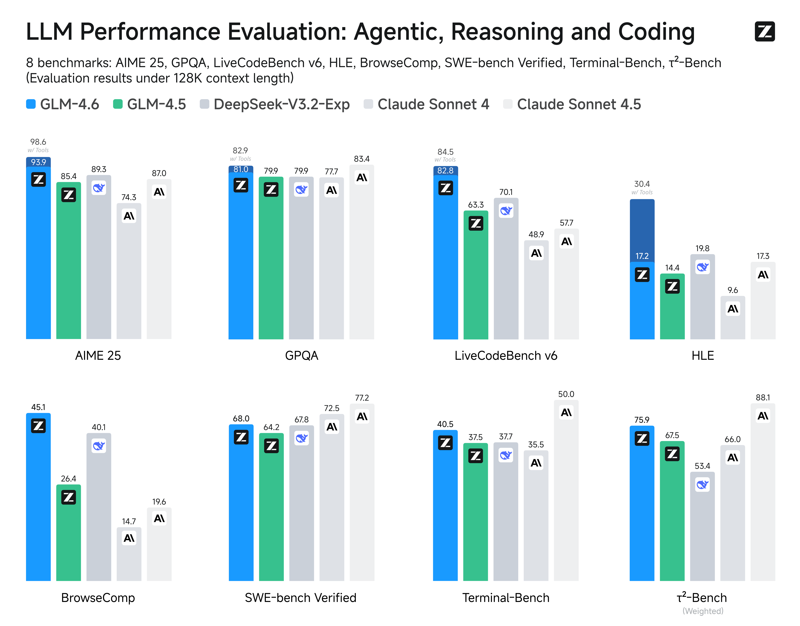

# GLM-4.6 & GLM-4.5

[中文阅读](./README_zh.md) | [English](./README.md)

<div align="center">

</div>
<p align="center">
    👋 <a href="resources/WECHAT.md" target="_blank">WeChat</a>または<a href="https://discord.gg/QR7SARHRxK" target="_blank">Discord</a>コミュニティにご参加ください。
    <br>
    📖 GLM-4.6の<a href="https://z.ai/blog/glm-4.6" target="_blank">技術ブログ</a>、<a href="https://arxiv.org/abs/2508.06471" target="_blank">技術レポート(GLM-4.5)</a>、<a href="https://zhipu-ai.feishu.cn/wiki/Gv3swM0Yci7w7Zke9E0crhU7n7D" target="_blank">Zhipu AI技術ドキュメント</a>をご覧ください。
    <br>
    📍 GLM-4.6 APIサービスを<a href="https://docs.z.ai/guides/llm/glm-4.6">Z.ai APIプラットフォーム</a>でご利用いただけます。
    <br>
    👉 ワンクリックで<a href="https://chat.z.ai">GLM-4.6</a>へ。
</p>

## モデル紹介

### GLM-4.6

GLM-4.5と比較して、**GLM-4.6**はいくつかの重要な改善をもたらします：

* **より長いコンテキストウィンドウ:** コンテキストウィンドウが128Kから200Kトークンに拡張され、より複雑なエージェントタスクを処理できるようになりました。
* **優れたコーディング性能:** コードベンチマークでより高いスコアを達成し、Claude Code、Cline、Roo Code、Kilo Codeなどのアプリケーションにおいて、視覚的に洗練されたフロントエンドページの生成を含む、より優れた実世界のパフォーマンスを示します。
* **高度な推論:** GLM-4.6は推論性能の明確な向上を示し、推論時のツール使用をサポートすることで、全体的な能力が強化されています。
* **より有能なエージェント:** GLM-4.6はツール使用と検索ベースのエージェントにおいてより強力な性能を発揮し、エージェントフレームワーク内でより効果的に統合されます。
* **洗練された文章:** スタイルと可読性において人間の好みにより適合し、ロールプレイングシナリオにおいてより自然に振る舞います。

私たちは、エージェント、推論、コーディングをカバーする8つの公開ベンチマークでGLM-4.6を評価しました。結果はGLM-4.5に対する明確な改善を示し、GLM-4.6は**DeepSeek-V3.1-Terminus**や**Claude Sonnet 4**などの国内外の主要モデルに対しても競争上の優位性を保持しています。



### GLM-4.5

**GLM-4.5**シリーズモデルは、インテリジェントエージェント向けに設計された基盤モデルです。GLM-4.5は総パラメータ数**355**億、アクティブパラメータ数**32**億を有し、GLM-4.5-Airはより軽量な設計で総パラメータ数**106**億、アクティブパラメータ数**12**億を採用しています。GLM-4.5モデルは、推論、コーディング、インテリジェントエージェント機能を統合し、インテリジェントエージェントアプリケーションの複雑な要求に応えます。

GLM-4.5とGLM-4.5-Airはどちらもハイブリッド推論モデルで、2つのモードを提供します：複雑な推論とツール使用のための思考モードと、即座の応答のための非思考モードです。

私たちは、GLM-4.5とGLM-4.5-Airの両方について、ベースモデル、ハイブリッド推論モデル、およびハイブリッド推論モデルのFP8版をオープンソース化しました。これらはMITオープンソースライセンスの下でリリースされ、商用利用および二次開発が可能です。

12の業界標準ベンチマークにわたる包括的な評価において、GLM-4.5は**63.2**というスコアで例外的な性能を達成し、すべてのプロプライエタリおよびオープンソースモデルの中で**第3位**にランクインしています。特に、GLM-4.5-Airは優れた効率性を維持しながら**59.8**という競争力のある結果を提供しています。


より多くの評価結果、ショーケース、技術詳細については、[技術レポート](https://arxiv.org/abs/2508.06471)または[技術ブログ](https://z.ai/blog/glm-4.5)をご覧ください。

モデルコード、ツールパーサー、推論パーサーは、[transformers](https://github.com/huggingface/transformers/tree/main/src/transformers/models/glm4_moe)、[vLLM](https://github.com/vllm-project/vllm/blob/main/vllm/model_executor/models/glm4_moe_mtp.py)、[SGLang](https://github.com/sgl-project/sglang/blob/main/python/sglang/srt/models/glm4_moe.py)の実装でご覧いただけます。

## モデルのダウンロード

[Hugging Face](https://huggingface.co/spaces/zai-org/GLM-4.5-Space)または[ModelScope](https://modelscope.cn/studios/ZhipuAI/GLM-4.5-Demo)で直接モデルを体験するか、以下のリンクからモデルをダウンロードできます。

| モデル            | ダウンロードリンク                                                                                                                                | モデルサイズ | 精度 |
|------------------|-----------------------------------------------------------------------------------------------------------------------------------------------|------------|-----------|
| GLM-4.6          | [🤗 Hugging Face](https://huggingface.co/zai-org/GLM-4.6)<br> [🤖 ModelScope](https://modelscope.cn/models/ZhipuAI/GLM-4.6)                   | 355B-A32B  | BF16      |
| GLM-4.5          | [🤗 Hugging Face](https://huggingface.co/zai-org/GLM-4.5)<br> [🤖 ModelScope](https://modelscope.cn/models/ZhipuAI/GLM-4.5)                   | 355B-A32B  | BF16      |
| GLM-4.5-Air      | [🤗 Hugging Face](https://huggingface.co/zai-org/GLM-4.5-Air)<br> [🤖 ModelScope](https://modelscope.cn/models/ZhipuAI/GLM-4.5-Air)           | 106B-A12B  | BF16      |
| GLM-4.5-FP8      | [🤗 Hugging Face](https://huggingface.co/zai-org/GLM-4.5-FP8)<br> [🤖 ModelScope](https://modelscope.cn/models/ZhipuAI/GLM-4.5-FP8)           | 355B-A32B  | FP8       |
| GLM-4.5-Air-FP8  | [🤗 Hugging Face](https://huggingface.co/zai-org/GLM-4.5-Air-FP8)<br> [🤖 ModelScope](https://modelscope.cn/models/ZhipuAI/GLM-4.5-Air-FP8)   | 106B-A12B  | FP8       |
| GLM-4.5-Base     | [🤗 Hugging Face](https://huggingface.co/zai-org/GLM-4.5-Base)<br> [🤖 ModelScope](https://modelscope.cn/models/ZhipuAI/GLM-4.5-Base)         | 355B-A32B  | BF16      |
| GLM-4.5-Air-Base | [🤗 Hugging Face](https://huggingface.co/zai-org/GLM-4.5-Air-Base)<br> [🤖 ModelScope](https://modelscope.cn/models/ZhipuAI/GLM-4.5-Air-Base) | 106B-A12B  | BF16      |

## システム要件

### 推論

「フル機能」のモデル推論のための最小および推奨構成を提供します。以下の表のデータは次の条件に基づいています：

1. すべてのモデルはMTPレイヤーを使用し、競争力のある推論速度を確保するために`--speculative-num-steps 3 --speculative-eagle-topk 1 --speculative-num-draft-tokens 4`を指定しています。
2. `cpu-offload`パラメータは使用していません。
3. 推論バッチサイズは`8`を超えません。
4. すべてFP8推論をネイティブサポートするデバイスで実行され、重みとキャッシュの両方がFP8形式であることを保証します。
5. サーバーメモリは`1T`を超える必要があり、通常のモデルのロードと動作を保証します。

以下の表の構成でモデルを実行できます：

| モデル       | 精度 | GPUタイプと数量   | テストフレームワーク |
|-------------|-----------|----------------------|----------------|
| GLM-4.5     | BF16      | H100 x 16 / H200 x 8 | sglang         |
| GLM-4.5     | FP8       | H100 x 8 / H200 x 4  | sglang         |
| GLM-4.5-Air | BF16      | H100 x 4 / H200 x 2  | sglang         |
| GLM-4.5-Air | FP8       | H100 x 2 / H200 x 1  | sglang         |

以下の表の構成では、モデルは完全な128Kコンテキスト長を利用できます：

| モデル       | 精度 | GPUタイプと数量    | テストフレームワーク |
|-------------|-----------|-----------------------|----------------|
| GLM-4.5     | BF16      | H100 x 32 / H200 x 16 | sglang         |
| GLM-4.5     | FP8       | H100 x 16 / H200 x 8  | sglang         |
| GLM-4.5-Air | BF16      | H100 x 8 / H200 x 4   | sglang         |
| GLM-4.5-Air | FP8       | H100 x 4 / H200 x 2   | sglang         |

AMD GPUを使用している場合は、[こちら](example/AMD_GPU/README.md)のAMD GPUデプロイメントドキュメントをご確認ください。

### ファインチューニング

以下の表の構成で[Llama Factory](https://github.com/hiyouga/LLaMA-Factory)を使用してコードを実行できます：

| モデル       | GPUタイプと数量 | 戦略 | バッチサイズ（GPU毎） |
|-------------|--------------------|----------|----------------------|
| GLM-4.5     | H100 x 16          | Lora     | 1                    |
| GLM-4.5-Air | H100 x 4           | Lora     | 1                    |

以下の表の構成で[Swift](https://github.com/modelscope/ms-swift)を使用してコードを実行できます：

| モデル       | GPUタイプと数量 | 戦略 | バッチサイズ（GPU毎） |
|-------------|--------------------|----------|----------------------|
| GLM-4.5     | H20 (96GiB) x 16   | Lora     | 1                    |
| GLM-4.5-Air | H20 (96GiB) x 4    | Lora     | 1                    |
| GLM-4.5     | H20 (96GiB) x 128  | SFT      | 1                    |
| GLM-4.5-Air | H20 (96GiB) x 32   | SFT      | 1                    |
| GLM-4.5     | H20 (96GiB) x 128  | RL       | 1                    |
| GLM-4.5-Air | H20 (96GiB) x 32   | RL       | 1                    |

## クイックスタート

**GLM-4.5とGLM-4.6は同じ推論方法を使用します。**

まず、`requirements.txt`に従って必要なパッケージをインストールしてください。

```shell
pip install -r requirements.txt
```

### transformers

`inference`フォルダの`trans_infer_cli.py`コードを参照してください。

### vLLM

+ BF16とFP8の両方は以下のコードで起動できます：

```shell
vllm serve zai-org/GLM-4.5-Air \
    --tensor-parallel-size 8 \
    --tool-call-parser glm45 \
    --reasoning-parser glm45 \
    --enable-auto-tool-choice \
    --served-model-name glm-4.5-air
```

8x H100 GPUを使用していて、GLM-4.5 / GLM-4.6モデルの実行時にメモリ不足に遭遇した場合は、`--cpu-offload-gb 16`（vLLMのみに適用）が必要です。

`flash infer`の問題に遭遇した場合は、一時的に`VLLM_ATTENTION_BACKEND=XFORMERS`を使用してください。`flash infer`を使用するために`TORCH_CUDA_ARCH_LIST='9.0+PTX'`を指定することもできます（GPUによってTORCH_CUDA_ARCH_LIST値が異なりますので、適宜確認してください）。

### SGLang

+ BF16

```shell
python3 -m sglang.launch_server \
  --model-path zai-org/GLM-4.5-Air \
  --tp-size 8 \
  --tool-call-parser glm45  \
  --reasoning-parser glm45 \
  --speculative-algorithm EAGLE \
  --speculative-num-steps 3 \
  --speculative-eagle-topk 1 \
  --speculative-num-draft-tokens 4 \
  --mem-fraction-static 0.7 \
  --served-model-name glm-4.5-air \
  --host 0.0.0.0 \
  --port 8000
```

+ FP8

```shell
python3 -m sglang.launch_server \
  --model-path zai-org/GLM-4.5-Air-FP8 \
  --tp-size 4 \
  --tool-call-parser glm45  \
  --reasoning-parser glm45  \
  --speculative-algorithm EAGLE \
  --speculative-num-steps 3  \
  --speculative-eagle-topk 1  \
  --speculative-num-draft-tokens 4 \
  --mem-fraction-static 0.7 \
  --disable-shared-experts-fusion \
  --served-model-name glm-4.5-air-fp8 \
  --host 0.0.0.0 \
  --port 8000
```

+ PD-Disaggregation

以下は、単一マシンの複数GPUを使用してPD-Disaggregationを実装するシンプルな方法で、PとDがそれぞれ4つのGPUを使用します。

```shell
python -m sglang.launch_server --model-path zai-org/GLM-4.5-Air  --disaggregation-mode prefill --disaggregation-ib-device mlx5_0 --tp-size 4
python -m sglang.launch_server --model-path zai-org/GLM-4.5-Air  --disaggregation-mode decode --port 30001 --disaggregation-ib-device mlx5_0 --tp-size 4 --base-gpu-id 4
python -m sglang_router.launch_router --pd-disaggregation --prefill http://127.0.0.1:30000 --decode http://127.0.0.1:30001 --host 0.0.0.0 --port 8000
```

### リクエストパラメータの説明

+ `vLLM`と`SGLang`を使用する場合、リクエストを送信する際にデフォルトで思考モードが有効になります。思考スイッチを無効にしたい場合は、`extra_body={"chat_template_kwargs": {"enable_thinking": False}}`パラメータを追加する必要があります。
+ 両方ともツール呼び出しをサポートしています。呼び出しにはOpenAIスタイルのツール記述形式を使用してください。
+ 具体的なコードについては、`inference`フォルダの`api_request.py`を参照してください。

### 評価

+ ツール統合推論については、[このドキュメント](resources/glm_4.6_tir_guide.md)を参照してください。
+ 検索ベンチマークについて、私たちは検索エージェントをサポートするために、思考モードでの検索ツール呼び出し用の特定のフォーマットを設計しました。詳細なテンプレートについては[こちら](resources/trajectory_search.json)を参照してください。
