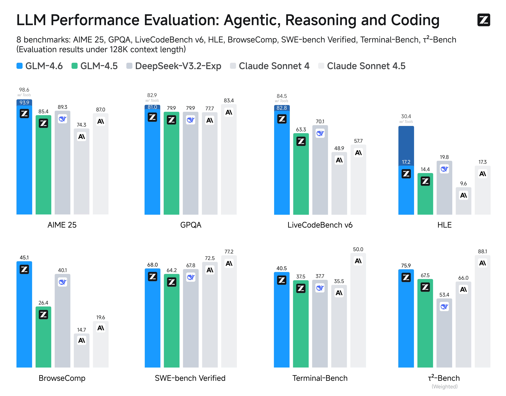
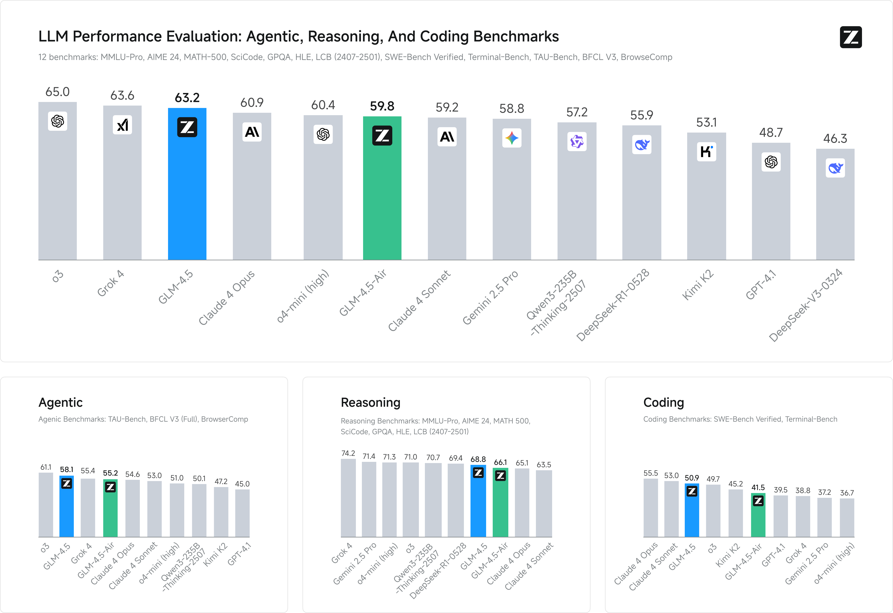

# GLM-4.6 & GLM-4.5

[English Version](./README.md)

<div align="center">

</div>
<p align="center">
    👋 加入我们的<a href="resources/WECHAT.md" target="_blank"> 微信群 </a>或<a href="https://discord.gg/QR7SARHRxK" target="_blank"> Discord </a>社区。
    <br>
    📖 查看 GLM-4.6<a href="https://z.ai/blog/glm-4.6" target="_blank"> 技术博客 </a> ， <a href="https://arxiv.org/abs/2508.06471" target="_blank"> 技术报告(GLM-4.5) </a> 以及 <a href="https://zhipu-ai.feishu.cn/wiki/Gv3swM0Yci7w7Zke9E0crhU7n7D" target="_blank"> 智谱AI技术文档 </a>。
    <br>
    📍 在<a href="https://docs.bigmodel.cn/cn/guide/models/text/glm-4.6"> 智谱AI开放平台 </a>上使用GLM-4.6 API服务。
    <br>
    👉 一键体验 <a href="https://chat.z.ai" >GLM-4.6 </a>。
</p>

## 模型介绍

### GLM-4.6

与 GLM-4.5 相比，**GLM-4.6** 带来了几个关键改进：

* **更长的上下文窗口：** 上下文窗口从 128K 扩展到 200K tokens，使模型能够处理更复杂的智能体任务。
* **更强的代码性能：** 模型在代码基准测试中取得了更高的分数，并在实际应用中表现更佳，例如 Claude Code、Cline、Roo Code 和 Kilo Code，包括在生成视觉上更精美的前端页面方面的提升。
* **更先进的推理能力：** GLM-4.6 在推理性能上有明显提升，并在推理过程中支持工具调用，从而带来更强的整体能力。
* **更强大的智能体：** GLM-4.6 在工具使用和基于搜索的智能体方面表现更强，并能更高效地融入智能体框架。
* **更精细的写作：** 更好地符合人类在风格和可读性上的偏好，并在角色扮演场景中表现得更加自然。

我们在涵盖智能体、推理和编程的八个公共基准上对 GLM-4.6 进行了评估。结果显示，GLM-4.6 相比 GLM-4.5 有显著提升，同时在对比 **DeepSeek-V3.1-Terminus** 和 **Claude Sonnet 4** 等国内外领先模型时也展现出了竞争优势。



### GLM-4.5

**GLM-4.5** 系列模型是专为智能体设计的基础模型。GLM-4.5拥有 **3550** 亿总参数量，其中 **320** 亿活跃参数；GLM-4.5-Air 采用更紧凑的设计，拥有
 **1060** 亿总参数量，其中 **120** 亿活跃参数。GLM-4.5模型统一了推理、编码和智能体能力，以满足智能体应用的复杂需求。

GLM-4.5 和 GLM-4.5-Air 都是混合推理模型，提供两种模式：用于复杂推理和工具使用的思考模式，以及用于即时响应的非思考模式。

我们已开源了 GLM-4.5 和 GLM-4.5-Air 的基础模型、混合推理模型以及混合推理模型的FP8版本。它们采用MIT开源许可证发布，可用于商业用途和二次开发。

在我们对12项行业标准基准的全面评估中，GLM-4.5表现卓越，得分 **63.2**，在所有专有和开源模型中排名**第3**
。值得注意的是，GLM-4.5-Air在保持优异效率的同时，仍取得了 **59.8** 的竞争性成绩。



如需了解更多评估结果、展示案例和技术细节，请访问我们的 [技术报告](https://arxiv.org/abs/2508.06471) 或者 [技术博客](https://z.ai/blog/glm-4.5)。

模型代码、工具解析器和推理解析器可在 [transformers](https://github.com/huggingface/transformers/tree/main/src/transformers/models/glm4_moe)、 [vLLM](https://github.com/vllm-project/vllm/blob/main/vllm/model_executor/models/glm4_moe_mtp.py)
和 [SGLang](https://github.com/sgl-project/sglang/blob/main/python/sglang/srt/models/glm4_moe.py) 的找到具体实现。

## 模型下载

你可以在 [Hugging Face](https://huggingface.co/spaces/zai-org/GLM-4.5-Space)
或 [ModelScope](https://modelscope.cn/studios/ZhipuAI/GLM-4.5-Demo) 上直接体验模型，也可以按照下面的链接下载模型。

| 模型               | 下载链接                                                                                                                                          | 模型大小      | 精度   |
|------------------|-----------------------------------------------------------------------------------------------------------------------------------------------|-----------|------|
| GLM-4.6          | [🤗 Hugging Face](https://huggingface.co/zai-org/GLM-4.6)<br> [🤖 ModelScope](https://modelscope.cn/models/ZhipuAI/GLM-4.6)                   | 355B-A32B  | BF16      |
| GLM-4.5          | [🤗 Hugging Face](https://huggingface.co/zai-org/GLM-4.5)<br> [🤖 ModelScope](https://modelscope.cn/models/ZhipuAI/GLM-4.5)                   | 355B-A32B | BF16 |
| GLM-4.5-Air      | [🤗 Hugging Face](https://huggingface.co/zai-org/GLM-4.5-Air)<br> [🤖 ModelScope](https://modelscope.cn/models/ZhipuAI/GLM-4.5-Air)           | 106B-A12B | BF16 |
| GLM-4.5-FP8      | [🤗 Hugging Face](https://huggingface.co/zai-org/GLM-4.5-FP8)<br> [🤖 ModelScope](https://modelscope.cn/models/ZhipuAI/GLM-4.5-FP8)           | 355B-A32B | FP8  |
| GLM-4.5-Air-FP8  | [🤗 Hugging Face](https://huggingface.co/zai-org/GLM-4.5-Air-FP8)<br> [🤖 ModelScope](https://modelscope.cn/models/ZhipuAI/GLM-4.5-Air-FP8)   | 106B-A12B | FP8  |
| GLM-4.5-Base     | [🤗 Hugging Face](https://huggingface.co/zai-org/GLM-4.5-Base)<br> [🤖 ModelScope](https://modelscope.cn/models/ZhipuAI/GLM-4.5-Base)         | 355B-A32B | BF16 |
| GLM-4.5-Air-Base | [🤗 Hugging Face](https://huggingface.co/zai-org/GLM-4.5-Air-Base)<br> [🤖 ModelScope](https://modelscope.cn/models/ZhipuAI/GLM-4.5-Air-Base) | 106B-A12B | BF16 |

## 系统要求

### 推理

我们提供了"全功能"模型推理的最低和推荐配置。下表中的数据基于以下条件：

1. 所有模型都使用MTP层，并指定`--speculative-num-steps 3 --speculative-eagle-topk 1 --speculative-num-draft-tokens 4`
   以确保具有竞争力的推理速度。
2. 不使用 `cpu-offload` 参数。
3. 推理批处理大小不超过 `8`。
4. 所有操作都在原生支持FP8推理的设备上执行，确保权重和缓存都采用FP8格式。
5. 服务器内存必须超过 `1T` 以确保正常的模型加载和运行。

模型可在下表配置下运行：

| 模型          | 精度   | GPU类型和数量             | 测试框架   |
|-------------|------|----------------------|--------|
| GLM-4.5     | BF16 | H100 x 16 / H200 x 8 | sglang |
| GLM-4.5     | FP8  | H100 x 8 / H200 x 4  | sglang |
| GLM-4.5-Air | BF16 | H100 x 4 / H200 x 2  | sglang |
| GLM-4.5-Air | FP8  | H100 x 2 / H200 x 1  | sglang |

在下表配置下，模型可以充分利用其128K上下文长度：

| 模型          | 精度   | GPU类型和数量              | 测试框架   |
|-------------|------|-----------------------|--------|
| GLM-4.5     | BF16 | H100 x 32 / H200 x 16 | sglang |
| GLM-4.5     | FP8  | H100 x 16 / H200 x 8  | sglang |
| GLM-4.5-Air | BF16 | H100 x 8 / H200 x 4   | sglang |
| GLM-4.5-Air | FP8  | H100 x 4 / H200 x 2   | sglang |

如果您使用 AMD 的 GPU，请查看 [AMD GPU 部署文档](example/AMD_GPU/README_zh.md)。

### 微调

使用 [Llama Factory](https://github.com/hiyouga/LLaMA-Factory) 框架，代码可在下表配置下运行：

| 模型          | GPU类型和数量  | 策略   | 批处理大小（每GPU） |
|-------------|-----------|------|-------------|
| GLM-4.5     | H100 x 16 | Lora | 1           |
| GLM-4.5-Air | H100 x 4  | Lora | 1           |

使用 [Swift](https://github.com/modelscope/ms-swift) 框架，代码可在下表配置下运行：

| 模型          | GPU类型和数量          | 策略   | 批处理大小（每GPU） |
|-------------|-------------------|------|-------------|
| GLM-4.5     | H20 (96GiB) x 16  | Lora | 1           |
| GLM-4.5-Air | H20 (96GiB) x 4   | Lora | 1           |
| GLM-4.5     | H20 (96GiB) x 128 | SFT  | 1           |
| GLM-4.5-Air | H20 (96GiB) x 32  | SFT  | 1           |
| GLM-4.5     | H20 (96GiB) x 128 | RL   | 1           |
| GLM-4.5-Air | H20 (96GiB) x 32  | RL   | 1           |

## 快速开始

**GLM-4.5 和-4.6 使用相同的推理办法。**

请根据`requirements.txt`安装所需的包。

```shell
pip install -r requirements.txt
```

### transformers

请参考 `inference` 文件夹中的 `trans_infer_cli.py` 代码。

### vLLM

+ BF16和FP8都可以用以下代码启动：

```shell
vllm serve zai-org/GLM-4.5-Air \
    --tensor-parallel-size 8 \
    --tool-call-parser glm45 \
    --reasoning-parser glm45 \
    --enable-auto-tool-choice \
    --served-model-name glm-4.5-air
```

如果您使用8x H100 GPU并且在运行GLM-4.5模型时遇到内存不足的问题，您需要使用`--cpu-offload-gb 16`（仅适用于vLLM）。

如果遇到`flash infer`问题，请使用`VLLM_ATTENTION_BACKEND=XFORMERS`作为临时替代方案。您也可以指定
`TORCH_CUDA_ARCH_LIST='9.0+PTX'`来使用`flash infer`（不同GPU有不同的TORCH_CUDA_ARCH_LIST值，请相应检查）。

### SGLang

+ BF16

```shell
python3 -m sglang.launch_server \
  --model-path zai-org/GLM-4.5-Air \
  --tp-size 8 \
  --tool-call-parser glm45  \
  --reasoning-parser glm45 \
  --speculative-algorithm EAGLE \
  --speculative-num-steps 3 \
  --speculative-eagle-topk 1 \
  --speculative-num-draft-tokens 4 \
  --mem-fraction-static 0.7 \
  --served-model-name glm-4.5-air \
  --host 0.0.0.0 \
  --port 8000
```

+ FP8

```shell
python3 -m sglang.launch_server \
  --model-path zai-org/GLM-4.5-Air-FP8 \
  --tp-size 4 \
  --tool-call-parser glm45  \
  --reasoning-parser glm45  \
  --speculative-algorithm EAGLE \
  --speculative-num-steps 3  \
  --speculative-eagle-topk 1  \
  --speculative-num-draft-tokens 4 \
  --mem-fraction-static 0.7 \
  --disable-shared-experts-fusion \
  --served-model-name glm-4.5-air-fp8 \
  --host 0.0.0.0 \
  --port 8000
```

+ PD 分离

以下是使用单机多卡器实现PD分离的简单办法，其中P和D各使用4张GPU。

```shell
python -m sglang.launch_server --model-path zai-org/GLM-4.5-Air  --disaggregation-mode prefill --disaggregation-ib-device mlx5_0 --tp-size 4
python -m sglang.launch_server --model-path zai-org/GLM-4.5-Air  --disaggregation-mode decode --port 30001 --disaggregation-ib-device mlx5_0 --tp-size 4 --base-gpu-id 4                                                                                                                                                        
python -m sglang_router.launch_router --pd-disaggregation --prefill http://127.0.0.1:30000 --decode http://127.0.0.1:30001 --host 0.0.0.0 --port 8000
```

### 请求参数说明

+ 使用`vLLM`和`SGLang`时，发送请求时默认启用思考模式。如果要禁用思考开关，需要添加
  `extra_body={"chat_template_kwargs": {"enable_thinking": False}}`参数。
+ 两者都支持工具调用。请使用OpenAI风格的工具描述格式进行调用。
+ 具体代码请参考`inference`文件夹中的`api_request.py`。
