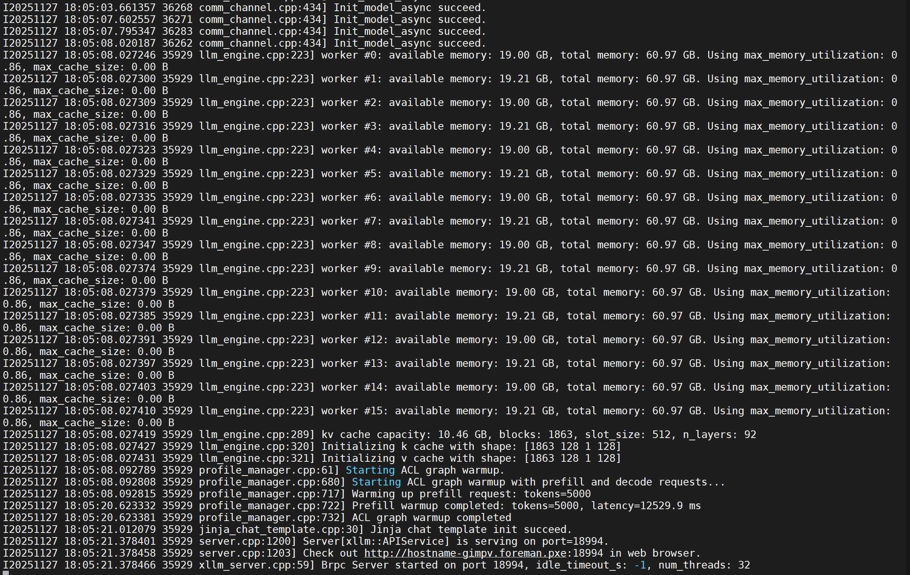

# 使用 xLLM 在 Ascend A3设备 推理 GLM-4.5 / 4.6 / 4.7 基座模型

+ 源码地址：https://github.com/jd-opensource/xllm

+ 国内可用: https://gitcode.com/xLLM-AI/xllm

## 1.拉取镜像环境

首先下载我们提供的镜像：

```bash
# A2 x86
docker pull quay.io/jd_xllm/xllm-ai:xllm-dev-hb-rc2-x86
# A2 arm
docker pull quay.io/jd_xllm/xllm-ai:xllm-dev-hb-rc2-arm
# A3 arm
docker pull quay.io/jd_xllm/xllm-ai:xllm-dev-hc-rc2-arm
```

**注意**: A2 机器性能未进行压测。

然后创建对应的容器

```bash
sudo docker run -it --ipc=host -u 0 --privileged --name mydocker --network=host \
 -v /var/queue_schedule:/var/queue_schedule \
 -v /usr/local/Ascend/driver:/usr/local/Ascend/driver \
 -v /usr/local/Ascend/add-ons/:/usr/local/Ascend/add-ons/ \
 -v /usr/local/sbin/npu-smi:/usr/local/sbin/npu-smi \
 -v /var/log/npu/conf/slog/slog.conf:/var/log/npu/conf/slog/slog.conf \
 -v /var/log/npu/slog/:/var/log/npu/slog \
 -v ~/.ssh:/root/.ssh  \
 -v /var/log/npu/profiling/:/var/log/npu/profiling \
 -v /var/log/npu/dump/:/var/log/npu/dump \
 -v /runtime/:/runtime/ -v /etc/hccn.conf:/etc/hccn.conf \
 -v /export/home:/export/home \
 -v /home/:/home/  \
 -w /export/home \
 quay.io/jd_xllm/xllm-ai:xllm-dev-hb-rc2-x86
```

## 2.拉取源码并编译

下载官方仓库与模块依赖：

```bash
git clone https://github.com/jd-opensource/xllm
cd xllm 
git checkout 31b7cafd60ef290c38cbc2320715407a6449af2f
git submodule init
git submodule update
```

编译依赖[vcpkg](https://github.com/microsoft/vcpkg)，镜像中已经提前配置完成，可以执行命令 "env|grep VCPKG" 检查。

（可选）如果您想要手动配置，可以执行如下命令:

```bash
git clone https://gitcode.com/xLLM-AI/vcpkg.git
cd vcpkg && git checkout ffc42e97c866ce9692f5c441394832b86548422c
export VCPKG_ROOT=/your/path/to/vcpkg
```

下载安装依赖:

```bash
pip install --upgrade setuptools wheel pre-commit
yum install numactl
```

执行编译，在`build/`下生成可执行文件`build/xllm/core/server/xllm`：

```bash
python setup.py build
```

## 3.启动模型

### 若机器为重启后初次拉起服务，需先执行以下脚本对device进行初始化

#若不执行且npu未初始化可能导致xllm进程拉起失败

```bash
python -c "import torch_npu; for i in range(16): torch_npu.npu.set_device(i)"
```

### 环境变量

```bash
##### 1， 配置依赖路径相关环境变量
export PYTHON_INCLUDE_PATH="$(python3 -c 'from sysconfig import get_paths; print(get_paths()["include"])')"
export PYTHON_LIB_PATH="$(python3 -c 'from sysconfig import get_paths; print(get_paths()["include"])')"
export PYTORCH_NPU_INSTALL_PATH=/usr/local/libtorch_npu/
export PYTORCH_INSTALL_PATH="$(python3 -c 'import torch, os; print(os.path.dirname(os.path.abspath(torch.__file__)))')"
export LIBTORCH_ROOT="$(python3 -c 'import torch, os; print(os.path.dirname(os.path.abspath(torch.__file__)))')"

export LD_LIBRARY_PATH=/usr/local/Ascend/ascend-toolkit/latest/opp/vendors/xllm/op_api/lib/:$LD_LIBRARY_PATH
export LD_LIBRARY_PATH=/usr/local/libtorch_npu/lib:$LD_LIBRARY_PATH
export LD_PRELOAD=/usr/lib64/libjemalloc.so.2:$LD_PRELOAD

source /usr/local/Ascend/ascend-toolkit/set_env.sh
source /usr/local/Ascend/nnal/atb/set_env.sh

##### 2， 配置日志相关环境变量
rm -rf /root/atb/log/
rm -rf /root/ascend/log/

rm -rf core.*
export ASDOPS_LOG_LEVEL=ERROR
export ASDOPS_LOG_TO_STDOUT=1
export ASDOPS_LOG_TO_FILE=1

##### 3. 配置性能、通信相关环境变量
export PYTORCH_NPU_ALLOC_CONF=expandable_segments:True
export NPU_MEMORY_FRACTION=0.96
export ATB_WORKSPACE_MEM_ALLOC_ALG_TYPE=3
export ATB_WORKSPACE_MEM_ALLOC_GLOBAL=1

export OMP_NUM_THREADS=12
export ALLOW_INTERNAL_FORMAT=1

export ATB_LAYER_INTERNAL_TENSOR_REUSE=1
export ATB_LLM_ENABLE_AUTO_TRANSPOSE=0
export ATB_CONVERT_NCHW_TO_AND=1
export ATB_LAUNCH_KERNEL_WITH_TILING=1
export ATB_OPERATION_EXECUTE_ASYNC=2
export ATB_CONTEXT_WORKSPACE_SIZE=0
export INF_NAN_MODE_ENABLE=1
export HCCL_EXEC_TIMEOUT=0
export HCCL_CONNECT_TIMEOUT=7200
export HCCL_OP_EXPANSION_MODE="AIV"
export HCCL_IF_BASE_PORT=2864
```

## 启动命令 - GLM-4.5 / 4.6 / 4.7 （W8A8权重可8卡拉起）

```bash
BATCH_SIZE=256
#推理最大batch数量
XLLM_PATH="./myxllm/xllm/build/xllm/core/server/xllm"
#推理入口文件路径（上一步中编译产物）
MODEL_PATH=/export/home/models/GLM-4.5-w8a8/
#模型路径（此处为int量化的Glm-4.5）
DRAFT_MODEL_PATH=/export/home/models/GLM-4.5-MTP/
#Glm-4.5 导出的mtp权重(导出可见下方教程)

MASTER_NODE_ADDR="11.87.49.110:10015"
LOCAL_HOST="11.87.49.110"
# Service Port
START_PORT=18994
START_DEVICE=0
LOG_DIR="logs"
NNODES=8

for (( i=0; i<$NNODES; i++ ))
do
  PORT=$((START_PORT + i))
  DEVICE=$((START_DEVICE + i))
  LOG_FILE="$LOG_DIR/node_$i.log"
  nohup numactl -C $((i*12))-$((i*12+11)) $XLLM_PATH \
    --model $MODEL_PATH \
    --model_id glmmoe \
    --host $LOCAL_HOST \
    --port $PORT \
    --devices="npu:$DEVICE" \
    --master_node_addr=$MASTER_NODE_ADDR \
    --nnodes=$NNODES \
    --node_rank=$i \
    --max_memory_utilization=0.86 \
    --max_tokens_per_batch=5000 \
    --max_seqs_per_batch=$BATCH_SIZE \
    --communication_backend=hccl \
    --enable_schedule_overlap=true \
    --enable_prefix_cache=true \
    --enable_chunked_prefill=true \
    --enable_acl_graph=true \
    --draft_model $DRAFT_MODEL_PATH \
    --draft_devices="npu:$DEVICE" \
    --num_speculative_tokens 1 \
    > $LOG_FILE 2>&1 &
done

#numactl -C $((i*12))-$((i*12+11))      
#                           亲和性绑核(亲和性查询命令： npu-smi info -t topo)
#--max_memory_utilization   单卡最大显存占用比例
#--max_tokens_per_batch     单batch最大token数  （主要限制prefill）
#--max_seqs_per_batch       单batch最大请求数   （主要限制decode）
#--communication_backend    通信backend 建议hccl
#--enable_schedule_overlap  开启异步调度
#--enable_prefix_cache      开启prefix_cache
#--enable_chunked_prefill   开启chunked_prefill
#--enable_acl_graph         开启aclgraph
#--draft_model              mtp - mtp权重路径
#--draft_devices            mtp - mtp推理设备(与主模型同一)
#--num_speculative_tokens   mtp - 预测token数
#--tool_call_parser=glm47   开启 glm4.7 tool_parser
```

日志出现"Brpc Server Started"表示服务成功拉起。拉起成功截图：



## 其他可选环境变量

```bash
#开启确定性计算
export LCCL_DETERMINISTIC=1
export HCCL_DETERMINISTIC=true
export ATB_MATMUL_SHUFFLE_K_ENABLE=0

#开启动态profiling模式
export PROFILING_MODE=dynamic
\rm -rf ~/dynamic_profiling_socket_*
```

## 启动命令 - 双机16卡拉起样例

### Node0 (master)

```bash

MASTER_NODE_ADDR="11.87.49.110:10015"
LOCAL_HOST="11.87.49.110"
# Service Port
START_PORT=18994
START_DEVICE=0
LOG_DIR="logs"
NNODES=16
LOCAL_NODES=8
START_LISTEN_PORT=16009

export HCCL_IF_BASE_PORT=2864

for (( i=0; i<$LOCAL_NODES; i++ ))
do
  PORT=$((START_PORT + i))
  DEVICE=$((START_DEVICE + i))
  LISTEN_PORT=$((START_LISTEN_PORT + i))
  LOG_FILE="$LOG_DIR/node_$i.log"
  #nohup $XLLM_PATH \
  nohup numactl -C $((DEVICE*12))-$((DEVICE*12+11)) $XLLM_PATH \
    --model $MODEL_PATH \
    --model_id glmmoe \
    --host $LOCAL_HOST \
    --port $PORT \
    --devices="npu:$DEVICE" \
    --master_node_addr=$MASTER_NODE_ADDR \
    --nnodes=$NNODES \
    --node_rank=$i \
    --max_memory_utilization=0.86 \
    --max_tokens_per_batch=20000 \
    --max_seqs_per_batch=$BATCH_SIZE \
    --enable_prefix_cache=false \
    --enable_chunked_prefill=false \
    --communication_backend=hccl \
    --enable_schedule_overlap=false \
    --enable_acl_graph=false \
    --rank_tablefile=hccl_8+8.json \
    > $LOG_FILE 2>&1 &

done
```

#### Node1 (worker)

```bash

MASTER_NODE_ADDR="11.87.49.110:10015"
LOCAL_HOST="11.87.49.111"
# Service Port
START_PORT=18994
START_DEVICE=0
LOG_DIR="logs"
NNODES=16
LOCAL_NODES=8
START_LISTEN_PORT=16009

export HCCL_IF_BASE_PORT=2864

for (( i=0; i<$LOCAL_NODES; i++ ))
do
  PORT=$((START_PORT + i))
  DEVICE=$((START_DEVICE + i))
  LISTEN_PORT=$((START_LISTEN_PORT + i))
  LOG_FILE="$LOG_DIR/node_$i.log"
  #nohup $XLLM_PATH \
  nohup numactl -C $((DEVICE*12))-$((DEVICE*12+11)) $XLLM_PATH \
    --model $MODEL_PATH \
    --model_id glmmoe \
    --host $LOCAL_HOST \
    --port $PORT \
    --devices="npu:$DEVICE" \
    --master_node_addr=$MASTER_NODE_ADDR \
    --nnodes=$NNODES \
    --node_rank=$((i+LOCAL_NODES)) \
    --max_memory_utilization=0.86 \
    --max_tokens_per_batch=20000 \
    --max_seqs_per_batch=$BATCH_SIZE \
    --enable_prefix_cache=false \
    --enable_chunked_prefill=false \
    --communication_backend=hccl \
    --enable_schedule_overlap=false \
    --enable_acl_graph=false \
    --rank_tablefile=hccl_8+8.json \
    > $LOG_FILE 2>&1 &

done
```

#### ranktable样例
 ranktable配置指导：https://www.hiascend.com/document/detail/zh/canncommercial/83RC1/hccl/hcclug/hcclug_000014.html

```json
{
    "version": "1.0",
    "server_count": "2",
    "server_list": [
        {
            "server_id": "11.87.49.110",
            "device": [
                {
                    "device_id": "0",
                    "device_ip": "11.86.23.210",
                    "rank_id": "0"
                },
                ...
                {
                    "device_id": "7",
                    "device_ip": "11.86.23.217",
                    "rank_id": "7"
                }
            ],
            "host_nic_ip": "reserve"
        },
        {
            "server_id": "11.87.49.111",
            "device": [
                {
                    "device_id": "0",
                    "device_ip": "11.87.63.202",
                    "rank_id": "8"
                },
                ...
                {
                    "device_id": "7",
                    "device_ip": "11.87.63.209",
                    "rank_id": "15"
                }
            ],
            "host_nic_ip": "reserve"
        }
    ],
    "status": "completed"
}
```

## EX1.mtp权重导出

```bash
pip install transformers==4.54.0
cd xllm/tools/
vi export_deepseek_mtp.py

#修改new_config中 DeepseekV3MtpForCausalLM -> Glm4MoeMtpForCausalLM, deepseek_v3_mtp -> glm4_moe_mtp

python export_deepseek_mtp.py --input_dir ${GLM-4.5-path} --output_dir ${GLM-4.5-mtp-path}
```

## EX2.device NUMA亲和性查看

命令：

```bash
npu-smi info -t topo
```

前述命令中

```bash
numactl -C $((DEVICE*12))-$((DEVICE*12+11))
```

表示该进程绑在对应亲和的核上，可根据机器具体情况修改绑定的核id

## EX3.Glm-4.5 权重量化

### A. 开源仓下载：

https://modelers.cn/models/Modelers_Park/GLM-4.5-w8a8

### B. 手动量化

#### 拉取量化库并增加适配脚本

```bash
git clone https://gitcode.com/Ascend/msit.git
cd msit
git checkout tag_MindStudio_8.2.RC1.B120_002

# 创建glm4moe适配代码
cd msit/msmodelslim/msmodelslim/pytorch/llm_ptq/model/
mkdir glm4moe
cp qwen3/* glm4moe/

vi __init__.py 
##########
__all__ = ['Glm4moeAdapter']

from .glm4moe import Glm4moeAdapter
##########

mv qwen3.py glm4moe.py
vi glm4moe.py 
##########
15 @ModelAdapterRegistry.register("glm4_moe")
16 @ModelAdapterRegistry.register("glm4moe")
17 class Glm4moeAdapter(ModelAdapter):
##########

vi msit/msmodelslim/msmodelslim/pytorch/llm_ptq/model/__init__.py
##########
18 from .base import ModelAdapter, ModelAdapterRegistry
19 from .deepseek_v2 import DeepseekV2Adapter
20 from .hunyuan import HunyuanLargeAdapter, HunyuanVideoAdapter
21 from .qwen3 import Qwen3Adapter
22 from .flux import FluxAdapter
23 from .glm4moe import Glm4moeAdapter
##########

```

#### 安装量化工具并修改量化脚本

```bash
cd msit/msmodelslim/
bash install.sh 

#基于qwenmoe量化脚本修改
cd msmodelslim/example/Qwen3-MOE
cp quant_qwen_moe_w8a8.py quant_glm_moe_w8a8.py 
vi quant_glm_moe_w8a8.py 
##########
133     disable_names = []
134     for ids in range(config.num_hidden_layers):
135         if ids in [0,1,2]:
136             disable_names.append("model.layers." + str(ids) + ".mlp.down_proj")
137         disable_names.append("model.layers." + str(ids) + ".self_attn.o_proj")
138         #disable_names.append("model.layers." + str(ids) + ".mlp.gate")
##########
```

##### 升级transformers版本

```bash
pip3 install attrs cython 'numpy>=1.19.2,<=1.24.0' decorator sympy cffi pyyaml pathlib2 psutil protobuf==3.20.0 scipy requests absl-py
pip install transformers==4.54.0
```

##### 修改modeling源码

```bash
vi /usr/local/python3.11.13/lib/python3.11/site-packages/transformers/models/glm4_moe/modeling_glm4_moe.py 
##########
236         self.e_score_correction_bias = nn.Parameter(torch.zeros((self.n_routed_experts), dtype=torch.float32))
237         #self.register_buffer("e_score_correction_bias", torch.zeros((self.n_routed_experts), dtype=torch.float32))
##########

```

量化执行

```bash
export PYTORCH_NPU_ALLOC_CONF=expandable_segments:True
python3 quant_glm_moe_w8a8.py --model_path /oripath --save_path /w8a8path --trust_remote_code True --mindie_format

#并在生成的权重config中加入参数："attn_quantize": "w8a8"
cp zai-org/GLM-4.5/chat_template.jinja ./
```

## 测试结果

xLLM 在 A3 设备上性能强劲，欢迎在 [这里](result.md) 查看测试报告。
